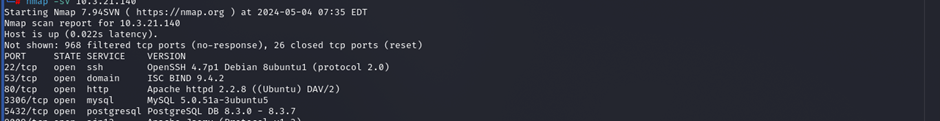

Executive Summary

The network penetration test on [GCBS] infrastructure was conducted in line with the CAP1 assignment for SWS, aiming to evaluate server security before internet release. Through comprehensive scans and simulated attacks, vulnerabilities were identified, aligning with CAP1's objectives. Actionable recommendations were provided for remediation, empowering [GCBS] to enhance its security posture effectively. 

Approach

I approach to the network penetration test assessment involved thorough reconnaissance, scanning, and exploitation techniques to simulate real-world attack scenarios. We utilized industry-standard tools and methodologies to identify open ports, services, and potential vulnerabilities within the target environment. Each step of the assessment was carefully documented to ensure transparency and accuracy in our findings.

Scope
The scope of the assessment encompassed a comprehensive evaluation of the network infrastructure, including but not limited to:

Identification of open ports and services
Version detection and vulnerability assessment
Exploitation of identified vulnerabilities
Simulation of unauthorized access and privilege escalation
Recommendations for remediation and security enhancement

Assessment Overview and Recommendations
The assessment revealed several critical findings and recommendations for improving the security posture of [GCBS] network infrastructure. Key findings include:

Identification of open ports and services, including SSH, DNS, HTTP, MySQL, PostgreSQL, and AJP13.
Exploitation of vulnerabilities such as weak credentials, PHP CGI vulnerabilities, and default configurations.
Recommendations for remediation, including:
Patching known vulnerabilities in software versions.
Implementing strong password policies and multi-factor authentication.
Regularly updating and monitoring network configurations.
Conducting regular security assessments and penetration tests.

Network Penetration Test Assessment Summary
conducted a SYN scan with aggressive options, including OS and version detection, against the IP address 10.3.21.140.

 
Based on the provided Nmap scan results, here's a summary of the network penetration test assessment:
1.SSH (Port 22):
State: Open
Service: SSH (Secure Shell)
Version: OpenSSH 4.7p1 Debian 8ubuntu1 (protocol 2.0)

2.DNS (Port 53):
State: Open
Service: Domain Name System (DNS)
Version: ISC BIND 9.4.2

3.HTTP (Port 80):
State: Open
Service: HTTP
Version: Apache httpd 2.2.8 (Ubuntu) DAV/2

4.MySQL (Port 3306):
State: Open
Service: MySQL Database
Version: MySQL 5.0.51a-3ubuntu5

5.PostgreSQL (Port 5432):
State: Open
Service: PostgreSQL Database
Version: PostgreSQL DB 8.3.0 - 8.3.7

6.AJP13 (Port 8009):
State: Open
Service: Apache Jserv
Version: Protocol v1.3

This provides an overview of the services running on the target system along with their respective versions and open ports. It can serve as a starting point for further analysis and potential vulnerability assessment.

Network Compromise Walkthrough
Introduction
In today's digital world, organizations are constantly under threat from cyber attackers who are always finding new ways to exploit weaknesses in their network systems. This walkthrough takes through a simulated scenario of how attackers might breach a network from within, using tactics commonly seen in real-life cyberattacks.

We will explore each step of the attack process, from the initial stages of scoping out the network to the final stage of stealing data. By dissecting the attacker's moves, like how they gain access, move around undetected, and cover their tracks, we will gain valuable insights into how these breaches happen.

Even though this scenario is simulated, the vulnerabilities and tactics we will discuss are very much based on what happens in the real world. By understanding how attackers operate, we can better defend against similar attacks and protect our networks.

Throughout this walkthrough, we will break down each stage of the attack process, giving a deeper understanding of how cyber breaches happen and what steps you can take to defend against them effectively.

1.SSH Port (22)
Step1: SSH Service Info
Scanning the IP address to gather information about the SSH service, with the intention of exploiting potential vulnerabilities to gain root access.

 
Through this information, we know that port is open which indicates that ssh services is actively listening for incoming connections and also implementation of SSH being used. SSH protocol version 2.0 is being used, which is more secure compared to older version 1.0. So, with the version information, one can search for known vulnerabilities associated with OpenSSH 4.7p1 Debian 8ubuntu1. 

Step2: Metasploit SSH Exploits using the ssh_login
Used Metasploit SSH using the ssh_login(auxiliary/scanner/ssh/ssh_login) to gain unauthorized access to a target system’s SSH services by trying various username and password combinations. 

 
Step3: After that to run the Metasploit set the virtual box target to gain the access.
First create a file name username.txt and password.txt by inserting a random text inside it.

 
Step4: Now all the set has been done and running the attack to gain access.

 
Step5: So, we can see that there is one success “user:user” it means that SSH session is been open and we gain the access and also now we can get in.

 
We have established a session with the machine and logged in as a user. Since we now have access to the machine, we can perform various actions. Therefore, I created a new directory named "tshewang_was_here." This is how I gained root access through port 22 SSH and made the necessary changes.

2.HTTP (Port 80)
Introductions:
Port 80 serves as the gateway for HTTP (Hypertext Transfer Protocol), the backbone of communication on the internet. It acts as the channel through which web browsers interact with web servers, facilitating the exchange of text, images, videos, and other multimedia content. Whether it's accessing websites, web applications, or online services, port 80 plays a pivotal role in delivering information seamlessly across the web. By listening on port 80, web servers await requests from clients, enabling users worldwide to navigate the vast landscape of the internet with ease. Its ubiquitous presence underscores its significance in the digital age, where connectivity and accessibility are paramount.

Step 1: Http info

 
This provide information saying that the port is open which indicates the http services is active and implementation of the HTTP server being used, which is Apache httpd version 2.2.8 running on Ubuntu. Additionally, "DAV/2" suggests that WebDAV (Web Distributed Authoring and Versioning) is enabled on the server.

Step2: Metasploit Http exploit
First we search php_cgi to aim at identifying and exploiting vulnerabilities in PHP CGI scripts to compromise the target web server.

 
Step3: Then used the exploit/multi/http/php_cgi_arg_injection because it used to exploit a vulnerability in PHP CGI scripts through HTTP, allowing to execute arbitrary commands on the target server.

 
After that set the required virtual box target such as rhosts 10.3.21.140 and lport 80 in order to gain access.

Step4: running the attack after all the set is completed.

 
Here we can see that session is open so it means the attack is complete and now we can gain the access for the port 80 http.

Step5: now we are getting into the session and checking the root access.

Now that we are inside the machine, we have access to make the necessary changes, such as adding or modifying directories. That how i got the root access for the http port 80.

5.PostgreSQL (Port 5432)
introduction
PostgreSQL stands as a leading choice for organizations and developers seeking a reliable, feature-rich, and extensible database management system for their applications and projects. Its commitment to standards compliance, data integrity, and extensibility continues to make it a preferred option in the ever-evolving landscape of data management technologies.

step1: postgreSQL info

Based on this information, we know that there's an active PostgreSQL database service running on port 5432, and it's within the version range of 8.3.0 to 8.3.7. This information can be useful for system administrators, developers, or anyone managing or interacting with the PostgreSQL database instance.

step2: Metasploit PostgreSQL exploit using postgres_login
used metasploit postgresql uisng postgres_login(auxiliary/scanner/postgres/postgres_login) because for scanning and testing weak or default credentials on PostgreSQL database servers so that we can gain access to the database.

step3: set the required virtual box target to gain access to the database.

step4: now running the attack on the postgresql.

We can see that one login was successful for the PostgreSQL server with the username and password set as 'postgres'.

step5: getting into the postgres database.

Successfully logged in to the PostgreSQL server with the username and password set as 'postgres', and made changes in the database by creating a table named 'tshewang', indicating that I gained access to the server and performed desired actions, thereby obtaining root access to the PostgreSQL database on port 5432.

Remediation Summary
To strengthen [GCBS] security posture, here are key steps to take:

Keep Systems Updated:
Regularly update all systems with the latest security patches.
Prioritize patching critical vulnerabilities.

Strengthen Passwords:
Enforce strong passwords and change them regularly.

Secure Configurations:
Review and adjust system configurations to minimize vulnerabilities.
Disable unnecessary services and ports.

Train Employees:
Provide security awareness training to all staff.
Encourage reporting of any suspicious activity.

Monitor Networks Actively:
Deploy intrusion detection systems to monitor for threats.
Keep detailed logs of network activity.

Prepare for Incidents:
Develop and regularly test an incident response plan.
Ensure clear communication channels during incidents.

Regular Assessments:
Conduct regular security assessments, including penetration tests.
Seek expert advice to address vulnerabilities effectively.

Implementing these measures will greatly improve [GCBS] defense against cyber threats and safeguard its network and data.